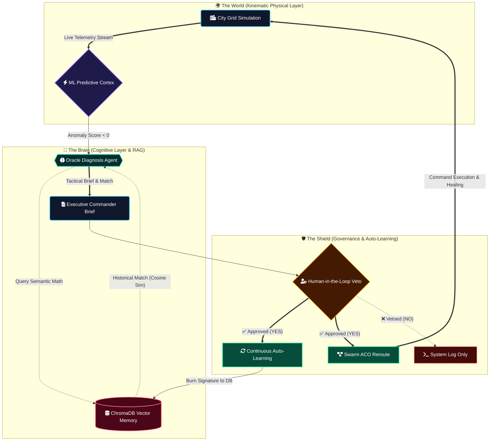

<div align="center">
  
# 🛡️ City Connect Omega: Prime Edition
### *Autonomous Cyber-Physical Defense Grid with Continuous Vector Learning*

  
  
  
  

</div>

---

> **An autonomous, multi-agent cyber-immune system for mission-critical Smart City IoT grids.** Built with Agentic AI for tactical diagnostics, **Episodic Vector Memory (RAG)** for historical threat recognition, and a Human-in-the-Loop (HOTL) Continuous Learning architecture that evolves the swarm's intelligence with every defeated zero-day attack.

## 🏗️ System Architecture

The project is built on a **Distributed Microservice Architecture**, decoupling physical asset simulation from the cognitive AI cortex. This ensures zero-latency UI performance while allowing the Llama-3.3 LLM to perform deep semantic searches against the vector database. Built as a demonstration of advanced Agentic AI cognitive architectures, vector memory integration, and cyber-physical defense systems.


---

### Core Microservices
**1. Kinematic Physical Layer (app/simulation/):** A spatial engine simulating moving IoT nodes in a 1000x1000m coordinate space.

**2. Agentic Cognitive Layer (oracle_agent.py):** Powered by CrewAI and Groq (Llama-3.3). Specialized agents diagnose anomalies not by guessing, but by searching historical data.

**3. Episodic Vector Memory (chromadb):** A persistent high-dimensional database storing mathematical representations of every attack signature and proven countermeasure.

**4. Continuous Learning API (api_server.py):** Asynchronous FastAPI backend. When a human commander approves a tactic, this layer automatically embeds the zero-day footprint into the vector cortex for future recognition.

**5. Digital Twin Command Center (dashboard.py):** A high-performance 3D spatial visualization utilizing PyDeck and Streamlit with real-time popup logging.

### 🧠 Continuous Intelligence Loop
This sequence diagram tracks the advanced asynchronous communication between the physical grid, the RAG-enhanced AI, and the continuous learning feedback loop.
sequenceDiagram
    autonumber
    participant G as IoT Grid
    participant O as Oracle Agent
    participant V as Vector Database (ChromaDB)
    participant H as Human Commander
    participant A as API Auto-Learning

    G->>O: Push Anomalous Telemetry
    O->>V: Query Semantic Math (RAG)
    V-->>O: Return Historical Match & Countermeasure
    O-->>O: Formulate Tactical Brief
    O->>H: Request Execution Authorization
    H->>H: Review AI Reasoning
    alt Approved (YES)
        H->>A: Approve Action
        A->>V: Burn New Telemetry Signature to Memory
        A->>G: Deploy Countermeasures
    else Vetoed (NO)
        H->>G: Maintain Status Quo (Action Blocked)
    end

---
    
### 🧮 Scientific Mathematical Pillars

### I. High-Dimensional Semantic Retrieval (RAG Memory)
The AI does not rely on exact text matching. Telemetry signatures are converted into dense vector embeddings. The Vector Cortex uses **Cosine Similarity** to mathematically retrieve the closest historical threat signature to a live zero-day anomaly:

$$S_C(U, V) = \frac{\sum_{i=1}^{n} U_i V_i}{\sqrt{\sum_{i=1}^{n} U_i^2} \sqrt{\sum_{i=1}^{n} V_i^2}}$$

Where $U$ and $V$ are the high-dimensional vectors representing the current attack and historical database entries.

### II. Behavioral Anomaly Detection
The Predictive Cortex utilizes an unsupervised Isolation Forest algorithm to detect stealth threats before a node crashes. It isolates anomalies by measuring the path length $h(x)$:

$$s(x, n) = 2^{-\frac{E(h(x))}{c(n)}}$$

If the anomaly score $s \to 1$, the node is flagged for immediate Agentic interrogation.

### III. Decentralized Swarm Routing
When a physical asset is compromised, the Ant Colony Optimization (ACO) engine calculates dynamic rerouting paths based on simulated pheromone density ($\tau$) and heuristic safety visibility ($\eta$):

$$p_{ij}^k = \frac{[\tau_{ij}]^\alpha [\eta_{ij}]^\beta}{\sum_{l \in \mathcal{N}_i^k} [\tau_{il}]^\alpha [\eta_{il}]^\beta}$$


### 🚀 Mission-Critical Features
* **Episodic Cyber-Memory:** The system actively references a persistent database of past attacks to prescribe deterministic solutions.

* **Human-in-the-Loop Auto-Learning:** The AI grows smarter dynamically. Human approval of a tactic automatically trains the vector model on the new threat signature.

* **3D Digital Twin:** Real-time spatial mapping with PyDeck, featuring glowing tactical UI indicators.

* **Asynchronous AI Processing:** Native FastAPI BackgroundTasks ensure the physical grid and dashboard UI maintain sub-millisecond latency while the LLM "thinks".


### ⚙️ Lab Deployment & Quickstart
This environment is containerized and optimized for rapid deployment in tactical labs or Codespaces.

**1. Install Infrastructure:**
```Bash
pip install -r requirements.txt
```
**2. Configure Cognitive Engine:**
Create a .env file in the root directory.

```Code snippet
GROQ_API_KEY=your_secure_api_key_here
```
**3. Boot the Distributed Architecture:**
Initiate the physics simulation, Vector Cortex, and REST endpoints.

```Bash
uvicorn app.api_server:app --reload
```
**4. Launch the Command Center:**
Open a second terminal to start the 3D Tactical Dashboard.

```Bash
streamlit run dashboard.py
```

### 📜 License
This project is licensed under the Apache License 2.0 - see the LICENSE file for details.
